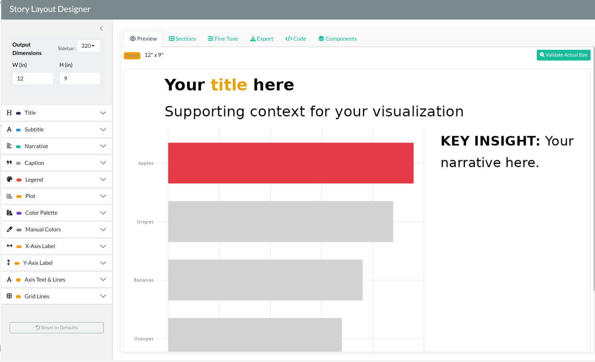

## Overview

Create presentation-ready visualizations following [Storytelling with Data](https://www.storytellingwithdata.com/) (STWD) principles. Provides story layouts that combine charts with narrative text, colored titles, and supporting context. Includes an interactive Shiny app for designing layouts, strategic color highlighting, and integration with the marquee package for colored text labels.

## Installation

```r
# Install from Codeberg
remotes::install_git("https://codeberg.org/usrbinr/stwd")
```

## Key Features

1. **Story Designer** - Interactive Shiny app for designing layouts with real-time preview
2. **Block Functions** - Modular components (title, subtitle, narrative, caption) for patchwork composition
3. **Highlight Colors** - Strategic color use: gray out noise, highlight signal
4. **Marquee Integration** - Color-matched text in titles and labels
5. **Color Palettes** - 9 palette packages with manual color assignment

## Workflow

The stwd workflow is:

1. **Create your plot** with ggplot2
2. **Design interactively** with `story_designer()`
3. **Copy the generated code** from the Code tab
4. **Paste into your Quarto document**

## Quick Start

```{r}
#| eval: false
library(stwd)
library(ggplot2)
library(patchwork)

# 1. Create your base plot
df <- data.frame(
    product = c("Apples", "Oranges", "Bananas", "Grapes"),
    sales = c(120, 85, 95, 110)
)

fill_colors <- highlight_colors(
    df$product,
    highlight = c("Apples" = "#E63946")
)

p <- ggplot(df, aes(x = reorder(product, sales), y = sales, fill = product)) +
    geom_col(width = 0.7) +
    coord_flip() +
    scale_fill_manual(values = fill_colors, guide = "none") +
    theme_minimal() +
    labs(x = NULL, y = "Units Sold")

# 2. Launch the designer
story_designer(plot = p)
```

The designer generates code like this:

```{r}
#| eval: true
#| label: readme-example-1
#| fig-width: 11
#| fig-height: 8.5
#| fig-dpi: 150
#| out-width: "100%"
library(stwd)
library(ggplot2)
library(patchwork)

df <- data.frame(
    product = c("Apples", "Oranges", "Bananas", "Grapes"),
    sales = c(120, 85, 95, 110)
)

fill_colors <- highlight_colors(
    df$product,
    highlight = c("Apples" = "#E63946")
)

p <- ggplot(df, aes(x = reorder(product, sales), y = sales, fill = product)) +
    geom_col(width = 0.7) +
    coord_flip() +
    scale_fill_manual(values = fill_colors, guide = "none") +
    theme_stwd() +
    labs(x = NULL, y = "Units Sold")

# Block components generated by story_designer()
title_plot <- title_block(
    "**Q4 Sales: {#E63946 Apples} Take the Lead**",
    title_size = 10
)

subtitle_plot <- subtitle_block(
    "Category performance, Oct-Dec 2024",
    subtitle_size = 8
)

narrative_plot <- text_narrative(
    "**Key takeaway:** {#E63946 Apples} outsold all other fruits.",
    size = 10
)

caption_plot <- caption_block(
    "Source: Internal Sales Database",
    caption_size = 6
)

# Combine with patchwork
content <- p + narrative_plot + plot_layout(widths = c(0.65, 0.35))
title_plot / subtitle_plot / content / caption_plot +
    plot_layout(heights = c(0.08, 0.05, 0.82, 0.05))
```

## Story Designer

Launch the interactive designer to customize your layout:

```{r}
#| eval: false
story_designer(plot = p)
```



The app provides:

- **Text Controls** - Title, subtitle, narrative, caption with marquee formatting
- **Legend Block** - Inline colored text legend positioned above, below, left, or right of chart
- **Color Palettes** - 9 palette packages: ggsci, MetBrewer, nord, PNWColors, rcartocolor, RColorBrewer, scico, viridis, wesanderson
- **Manual Colors** - Set default color (gray) for unassigned categories, assign specific colors to highlight key categories
- **Validate & Export** - Preview at actual size, export PNG/PDF/SVG, copy generated code

## Sizing for Quarto

Match your Quarto chunk options to the Story Designer's export dimensions:

```{r}
#| eval: false
#| fig-width: 12
#| fig-height: 9
#| fig-dpi: 150
#| out-width: "100%"

# Your patchwork code here...
```

| Chunk Option | Story Designer | Description |
|--------------|----------------|-------------|
| `fig-width` | Width (in) | Plot width in inches |
| `fig-height` | Height (in) | Plot height in inches |
| `fig-dpi` | DPI | Resolution (default 150) |
| `out-width` | - | Display width in document |

See the [Sizing Guide](vignettes/articles/sizing.qmd) for more details.

## Function Reference

| Function | Purpose |
|----------|---------|
| `story_designer()` | Interactive Shiny app for layout design |
| `title_block()` | Create title plots |
| `subtitle_block()` | Create subtitle plots |
| `text_narrative()` | Create narrative text blocks |
| `caption_block()` | Create caption plots |
| `legend_block()` | Create inline colored text legend |
| `highlight_colors()` | Gray out non-essential categories |
| `theme_stwd()` | Clean SWD theme (horizontal grid only) |

## License

MIT
